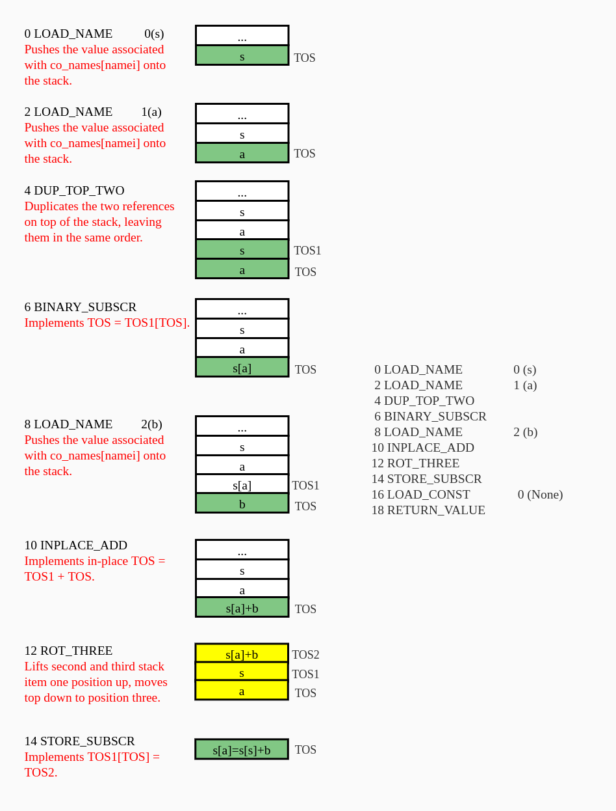

# 一、问题描述

## 1.1 源码

```python

```

输出：

```
  1           0 LOAD_NAME                0 (s)
              2 LOAD_NAME                1 (a)
              4 DUP_TOP_TWO
              6 BINARY_SUBSCR
              8 LOAD_NAME                2 (b)
             10 INPLACE_ADD
             12 ROT_THREE
             14 STORE_SUBSCR
             16 LOAD_CONST               0 (None)
             18 RETURN_VALUE
None
```

## 1.2 问题

以上代码来自于《Fluent Python 2》p60，？

# 二、问题分析

**Binary operations** 和 **In-place operations** 要出栈进行计算再入栈。

# 三、结果



