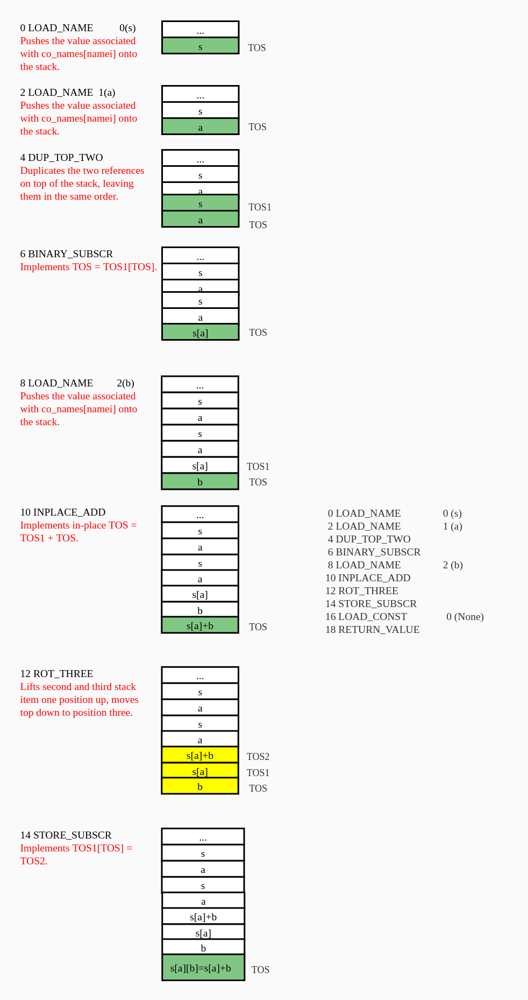

# 一、问题描述

## 1.1 源码

```python
import dis
print(dis.dis('s[a] += b'))
```

输出：

```
  1           0 LOAD_NAME                0 (s)
              2 LOAD_NAME                1 (a)
              4 DUP_TOP_TWO
              6 BINARY_SUBSCR
              8 LOAD_NAME                2 (b)
             10 INPLACE_ADD
             12 ROT_THREE
             14 STORE_SUBSCR
             16 LOAD_CONST               0 (None)
             18 RETURN_VALUE
None
```

## 1.2 问题

以上代码来自于《Fluent Python 2》p55-p56，我自己按照字节码指令的顺序绘制栈的变化，得不到代码执行的结果，请各位大佬帮忙看下问题出在哪里。

# 二、问题分析



以上是我按照字节码命令绘制的栈变化，但是最后得到的结果是`s[a]+b=s[a]+b`。

请问各位大佬，是我的绘制过程有问题(如：某一个操作其实没有入栈，或者某一个操作应该有出栈)还是说我理解有问题(如：其实字节码指令描述的并不是连续的过程)？
